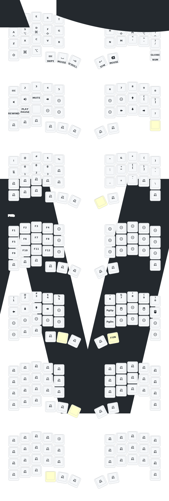

 I bought a pre-built bluetooth keyball39 and it was quite complicated (and extremely time consuming) to figure out how to customize this. so I thought I would write this up for anyone who may be in a similar situation!

So the first thing to know is that these keyball split keyboards run on two types of firmware:
  qmk - for regular wired ones
  zmk - for bluetooth models

For qmk, it's quite simple as you can use a website called remap to configure your keyboard settings, which uses another thing called via.
For zmk, it's a little more complicated as you have to reinstall the firmware with the keyboard settings each time you make a change, so that's the tradeoff for bluetooth wireless keyballs.

**Installation guide:**
  1. **Fork the ZMK Repo:** fork this repo to your github [zmk-config-Keyball39 github repo](https://github.com/tangbonze/zmk-config-Keyball39)
  2. **Access ZMK Configurator:** you can edit your keymap using the [zmk configurator](https://nickcoutsos.github.io/keymap-editor/).
  3. **Connect GitHub Repo:** Link to your GitHub repo with the ZMK repository to perform remaps.
  4. **Run GitHub Actions:** Execute the workflow via GitHub actions (next to pull requests). When it's done, find the firmware download
  5. **Download Firmware:** Extract the contents of the zip file; it should contain:
     - Left keyboard firmware
     - Right keyboard firmware
     - Settings firmware (for Bluetooth and other configurations).
  6. **Connect Keyball to Windows:** Plug one side of the Keyball into a Windows computer (Parallels or Windows recommended; avoid Mac due to formatting issues).
  7. **Activate Bootloader Mode:** 
     - Press the reset button on the keyboard twice (located under the plastic; screws may need to be removed).
     - Depending on your model you might have to touch two points on the circuit together to reset it 
  8. **Transfer Settings Firmware:** Drag the settings firmware into the "nicenano" folder that appears. It'll restart
  9. **Restart and Update Right Firmware:** Press the reset button twice again, and then drag the right side firmware into the same folder.
  10. **Repeat for Left Side:** Perform steps 8 and 9 for the left side firmware.

**Post-Setup:**
  - **Check Current Mapping:** A github action can be run to visualize your layers (if not already automatically)

  
**Troubleshooting Tips:**
  - **Mouse Layer Issue:** I had an issue where the mouse layer would activate randomly, it took me a while to figure out that it was because of minor vibrations that caused the trackball to move and accidentally activate the mouse layer for like a second.
    - to fix this change ```automouse-layer = <4>;``` to ```automouse-layer = <0>;``` in the ```keyball39_right.overlay``` and rebuild the firmware

good luck!!
 
Special Thanks to: <br>
PCB: *[yangxing844](https://github.com/yangxing844)* <br>
Case: *[delock](https://github.com/delock)* <br>
Firmware: *[Amos698](https://github.com/Amos698)* <br>

below are my own settings, some are taken from my habits from using a HHKB for 10 years


